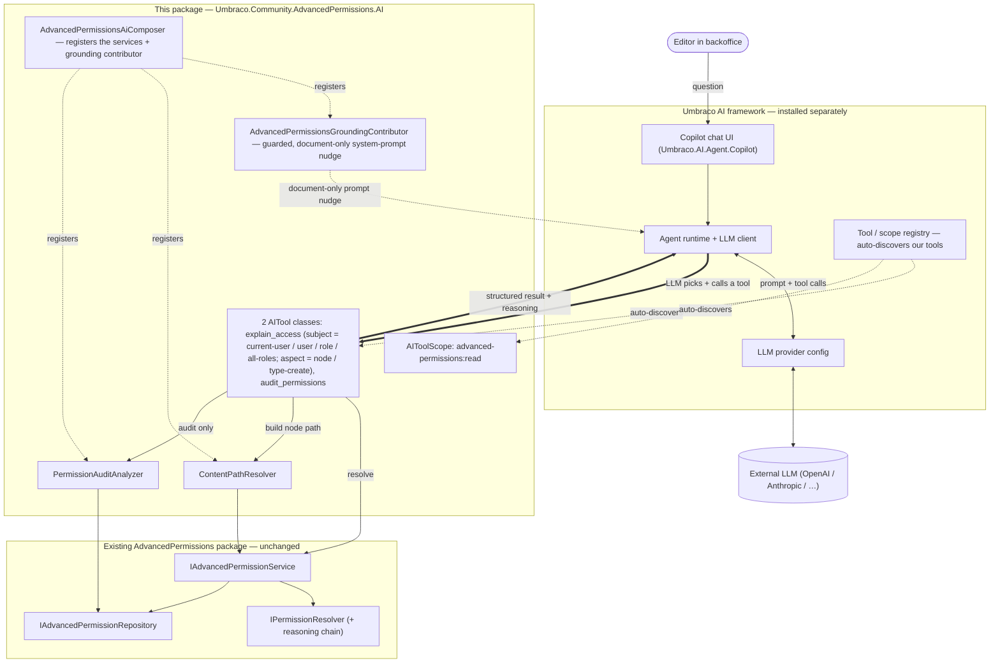

# Advanced Permissions for Umbraco — AI Copilot Tools

`Umbraco.Community.AdvancedPermissions.AI` is an **optional** companion package for
[Umbraco.Community.AdvancedPermissions](https://github.com/Luuk1983/Umbraco.Community.AdvancedPermissions).
It makes the Umbraco backoffice **AI copilot permission-aware**: editors and admins can ask, in plain
language, *who can do what* — and get answers grounded in the package's existing permission-resolution
engine (including the full reasoning chain), not in the model's guesswork.

> **This package is read-only.** It only *reads and explains* permissions — it never writes them. The
> `suggestFix` remediation (below) only *computes and describes* the changes an administrator could make
> by simulating them against the resolver; it applies nothing. AI-*authored* permission changes (with a
> human approval step) are tracked separately in
> [issue #33](https://github.com/Luuk1983/Umbraco.Community.AdvancedPermissions/issues/33).

## What you can ask the copilot

| Tool | Example prompt |
|------|----------------|
| `explain_access` (node aspect) | *"Why can't I delete this page?"*, *"Why can't Jane delete this page?"*, *"What can the Editors group do on /News?"*, *"Who can publish here?"* |
| `explain_access` (type-create aspect) | *"Why can't I create an Article here?"*, *"What document types can I create under /News?"*, *"Who can create a Landing Page here?"* |
| `audit_permissions` | *"Audit the permissions for the Editors role."*, *"Are there any risks under /News?"*, *"Is anything misconfigured?"* |

| `explain_access` (suggestFix) | *"Why can't I publish this — and what would fix it?"* |

`explain_access` is a single parameterized tool: a `subject` argument selects whether to evaluate the
**current user**, a specific **user**, a single **role** (or "All Users"), or **all roles** at a node.
An `aspect` argument selects which dimension of access to explain: **node** action permissions (edit /
delete / publish / move …, the default) or **type-create** — the "Insert Options" question of which
document types may be created under a node. For `aspect=type-create`, `nodeKey` is the *parent* node;
supply `contentTypeKey` to focus a single document type, or omit it for the full per-type roster
(document types that Umbraco's allowed-child-types config disallows are reported distinctly as
"Not applicable", separate from a permission Deny).

Set **`suggestFix=true`** to also get the concrete changes that would grant a *denied* action. This is
**not guesswork** — the package simulates a small, case-specific set of candidate entry mutations against
its own pure resolver and returns **only** the changes that actually flip the verdict to Allowed, ranked
least-privileged-first (remove the Deny → add an Allow on the node → add an Allow on an ancestor → add a
priority-override Allow). It is the deterministic fix for a real failure mode: an LLM left to itself will
claim a plain Allow can beat a same-node Deny — it cannot, and the simulation rejects that suggestion (an
explicit Deny is only beaten by removing it or by a priority-override Allow, which is itself defeated by a
competing priority-override Deny). `suggestFix` is honoured for the **node** aspect, the
current-user / user / role subjects (never all-roles), and only when a single `verb` is supplied (keeping
the work bounded — the all-verbs explanation attaches no remediation). Re-resolution goes **directly**
through the pure resolver on the in-memory mutated entries, never the cached service, and matches the
exact role set the verdict used (user groups + All Users for a user; the single role for a role subject).
Every returned option is a confirmed fact and is phrased as an administrator action — the companion still
writes nothing.

`audit_permissions` is likewise parameterized: a `scope` argument selects whether to scan all entries
for one **role** (the default), everything under a node's **subtree**, or the whole configuration
(**all**), with an optional minimum-severity filter. The `all` scope is best-effort — it sweeps every
live document node plus the root-level defaults, so entries left behind on deleted/trashed nodes are
not included. `audit_permissions` currently covers **node** permission entries only; auditing the
doc-type create ("Insert Options") entries is a planned follow-up (the analyzer's node-verb rules do
not map cleanly onto the default-Allow, content-type-keyed doc-type model).

Each tool returns the **structured effective permission plus the reasoning chain**; the copilot turns
that into a sentence. The AI never decides permissions itself — it only routes the question to a tool
and phrases the deterministic result your resolver computes.

## Requirements

- **Umbraco CMS 17.4.2+** (.NET 10) — required by Umbraco AI.
- **[Umbraco AI](https://github.com/umbraco/Umbraco.AI) 17.0.0**, installed and configured with an LLM
  provider. The backoffice chat UI comes from `Umbraco.AI.Agent.Copilot`.
- **`Umbraco.Community.AdvancedPermissions`** (the main package) — pulled in automatically as a dependency.

> **Umbraco v18:** Umbraco AI does not support v18 yet, so this companion targets the **v17** line. It
> will be forward-ported to v18 once Umbraco AI ships v18 support
> (track [umbraco/Umbraco.AI#201](https://github.com/umbraco/Umbraco.AI/pull/201)).

## Install

```bash
dotnet add package Umbraco.Community.AdvancedPermissions.AI
```

The tools and their permission scope (`advanced-permissions:read`) are **auto-discovered** by
Umbraco AI — no extra configuration beyond having Umbraco AI and an LLM provider set up.

## How it works



Request flow for *"Why can't Jane delete this page?"*:

```mermaid
sequenceDiagram
    actor E as Editor
    participant C as Umbraco AI Copilot
    participant L as LLM (via provider)
    participant T as uap_explain_access
    participant P as ContentPathResolver
    participant S as IAdvancedPermissionService

    E->>C: "Why can't Jane delete this page?"
    C->>L: prompt + tool catalogue + grounded context (node, user)
    Note over L: Picks explain_access;<br/>fills subject = User, userKey, nodeKey, verb = Delete
    L->>T: invoke(subject: User, userKey, nodeKey, "Umb.Document.Delete")
    T->>P: GetPathFromRoot(nodeKey)
    P-->>T: [rootKey … nodeKey]
    T->>S: ResolveAsync(user, node, path, verb)
    S-->>T: EffectivePermission { IsAllowed: false, reasoning[] }
    T-->>L: structured result (reasoning chain)
    L-->>C: turns the reasoning into plain language
    C-->>E: "Jane can't — Editors is explicitly Denied Delete at /News; this page inherits it."
```

- **Umbraco AI** (top) provides the copilot chat, the agent runtime, and the LLM connection.
- **This package** (middle) adds two auto-discovered `[AITool]` classes, a read-only tool scope, helper
  services (`ContentPathResolver`, `PermissionAuditAnalyzer`, `PermissionPresenter`), and a guarded
  runtime-context contributor that grounds the copilot on document conversations.
- **The existing permission package** (bottom) is **unchanged** — the tools call its
  `IAdvancedPermissionService`.

## Security

- **Read-only** — nothing the AI does here writes data. The `suggestFix` remediation depends only on the
  pure resolver, a single repository read, and a local copy of the entry list; it never calls any
  save/delete path and never persists a simulated mutation.
- **No privilege escalation by design** — answers come from the same resolver the backoffice uses, so
  the model cannot invent or grant a permission rule; it can only report what your engine computes. The
  remediation only names roles and nodes already present in the reasoning chain.
- Tools live under the `advanced-permissions:read` scope, so Umbraco AI's per-user-group governance can
  allow or deny them — `suggestFix` stays within that same read scope.

## Local verification (manual)

The test site in this repo is already wired to this package and the Umbraco AI runtime + copilot. To
verify end-to-end you only need to add **your own** LLM provider:

1. Add a provider package to the test site and pin its version, e.g.:
   ```bash
   dotnet add tests/Umbraco.Community.AdvancedPermissions.AI.TestSite/Umbraco.Community.AdvancedPermissions.AI.TestSite.csproj package Umbraco.AI.OpenAI
   ```
2. Set the key via user-secrets (not committed) and configure a connection/profile (in the backoffice AI
   UI on first run, or in `appsettings` referencing `$Umbraco:AI:Secrets:OpenAIApiKey`):
   ```bash
   dotnet user-secrets set "Umbraco:AI:Secrets:OpenAIApiKey" "sk-..." --project tests/Umbraco.Community.AdvancedPermissions.AI.TestSite
   ```
3. Run and open the backoffice copilot:
   ```bash
   dotnet run --project tests/Umbraco.Community.AdvancedPermissions.AI.TestSite -p:NuGetAudit=false --urls http://localhost:5000
   ```
4. Try: *"What can the Editors group do on the home page?"*, *"Who can publish here?"*,
   *"Audit the permissions for the Editors role."* and confirm the matching `uap_*` tool fires.

## Design notes / decisions

- **Optional companion package**, separate from the core package, so the permission package never forces
  the AI framework or an LLM provider on users who don't want it.
- **v17-first** — Umbraco AI is v17-only today; built and tested on v17, forward-ported to v18 when
  Umbraco AI supports it.
- **Native C# `[AITool]`s, not MCP** — Umbraco's MCP servers don't auto-expose custom Management API
  endpoints, and the in-backoffice copilot consumes C# tools directly. (An external MCP server for
  developer/automation agents is possible future work, not part of this package.)
- **Read-only first** — at Umbraco AI 17.0.0 a backend tool's `IsDestructive` flag does **not** trigger
  the copilot's human-in-the-loop approval (that is a frontend-tool mechanism). Permission *writes* are
  therefore deferred to [#33](https://github.com/Luuk1983/Umbraco.Community.AdvancedPermissions/issues/33),
  where they will be built as a frontend approval tool calling the existing permission endpoints.
- **Guarded grounding** — a small `IAIRuntimeContextContributor`
  (`AdvancedPermissionsGroundingContributor`) prepends one short system-prompt line **on document
  conversations only**. It tells the copilot that this site uses Advanced Permissions (so a block or
  read-only editor may be a permission `Deny`, not a structural limit) and to reach for the
  `uap_explain_access` / `uap_audit_permissions` tools before concluding otherwise — and it carries
  enough of the model (Allow/Deny per user group, scopes, inheritance, priority, Insert Options) to
  answer "how do I…" questions inline (the how-to is grounding, not a tool). It is deliberately defensive
  because Umbraco AI runs contributors on every agent run with no try/catch around them: it gates on the
  focused entity being a `document`, is append-only (never writes `Variables`/`Data`), wraps its whole
  body in a catch-all so it can never abort a run, and contributes only a static string (no I/O).
