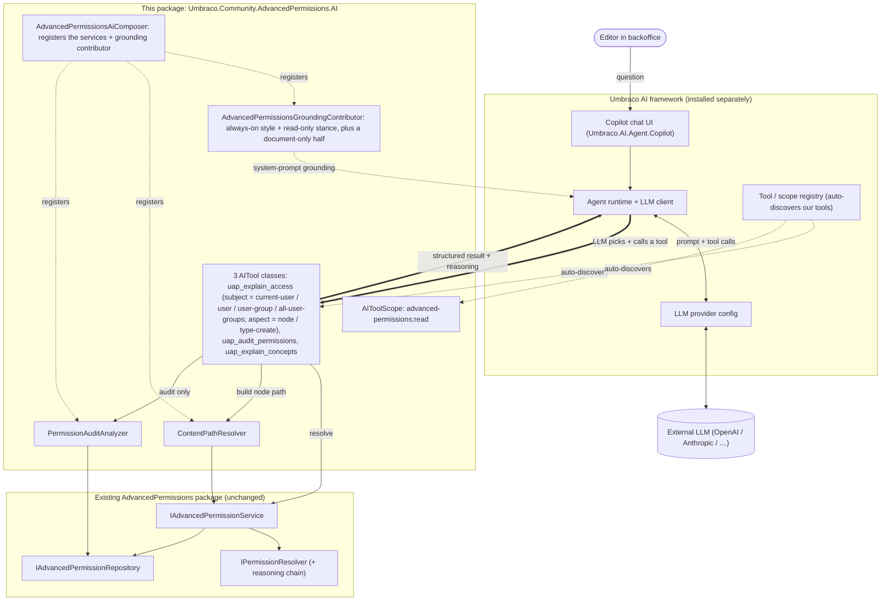

# Architecture

How the AI companion sits between Umbraco AI and the base permission package. These diagrams live here
rather than in the README because NuGet.org renders Mermaid as raw code.

## The three layers



- Umbraco AI, at the top, provides the copilot chat, the agent runtime and the LLM connection.
- This package, in the middle, adds three auto-discovered `[AITool]` classes, a read-only tool scope,
  helper services (`ContentPathResolver`, `PermissionAuditAnalyzer`, `PermissionPresenter`) and a
  runtime-context contributor that grounds the copilot.
- The base permission package, at the bottom, is unchanged. The tools simply call its
  `IAdvancedPermissionService`.

## A request, end to end

Request flow for *"Why can't Jane delete this page?"*:

```mermaid
sequenceDiagram
    actor E as Editor
    participant C as Umbraco AI Copilot
    participant L as LLM (via provider)
    participant T as uap_explain_access
    participant P as ContentPathResolver
    participant S as IAdvancedPermissionService

    E->>C: "Why can't Jane delete this page?"
    C->>L: prompt + tool catalogue + grounded context (node, user)
    Note over L: Picks uap_explain_access;<br/>fills subject = user, userKey, nodeKey, verb = Delete
    L->>T: invoke(subject: User, userKey, nodeKey, "Umb.Document.Delete")
    T->>P: GetPathFromRoot(nodeKey)
    P-->>T: [rootKey … nodeKey]
    T->>S: ResolveAsync(user, node, path, verb)
    S-->>T: EffectivePermission { IsAllowed: false, reasoning[] }
    T-->>L: structured result (reasoning chain)
    L-->>C: turns the reasoning into plain language
    C-->>E: "Jane can't. The Editors user group has a Deny entry on the Delete permission at /News, and this page inherits it."
```

The LLM never decides a permission. It picks a tool, fills in the arguments, then phrases the
deterministic result the resolver computed.

## The grounding split

`AdvancedPermissionsGroundingContributor` contributes to the copilot's system prompt in two halves:

- Always on (roughly 635 tokens): editor-facing terminology and readability rules, the read-only
  stance, and a pointer to `uap_explain_concepts`. It carries no definitions, only what a tool cannot
  deliver, because the style rules have to govern every sentence the copilot writes, including ones
  that paraphrase another tool's output.
- Document conversations only (roughly 300 tokens, appended): tool nudges that presume a focused node,
  the `suggestFix` rules, and the requirement to relay the `GrantedBy` and `Caution` fields.

The definitions themselves live in `uap_explain_concepts`, so their cost is paid only when a conceptual
question is actually asked. The pointer in the always-on half is what makes that safe. The failure it
fixes was the model answering confidently and wrongly from its own assumptions, and a reference is no
use if the model never thinks to open it.

The contributor is deliberately defensive, because Umbraco AI runs contributors on every agent run with
no `try`/`catch` around them. It gates on entity type, is append-only, wraps its whole body in a
catch-all, and contributes only a static string with no I/O.
